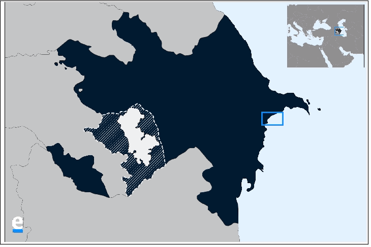

# MapMaker
### (This is the publicly available documentation for _MapMaker_, which is a closed source application under copyright by Pedal Technologies, Inc.)

_MapMaker_ is a crossplatform application for producing publication-quality maps of countries in Central Asia and the South Caucasus. [Pedal Technologies](http://pedal.tech/) was commissioned by [EurasiaNet](https://eurasianet.org/) to design and build _MapMaker_, and it has been used to produce maps for several of their articles (such as [here](https://eurasianet.org/georgian-coal-town-longs-for-chinese-rescue) and [here](https://eurasianet.org/azerbaijanis-displaced-by-war-seek-to-keep-memories-alive)). Eurasianet is a media organization based at Columbia University’s Harriman Institute, one of the leading centers in North America of scholarship on Eurasia.

I led development on this project, which included the following tasks:
- [x] Designing UI/UX
- [x] Building the infrastructure to generate base maps for each country (using `matplotlib` and data from [Natural Earth](https://www.naturalearthdata.com/))
- [x] Designing and implementing an efficient algorithm to place markers, labels, and connectors on the map automatically, without overlapping with country borders on the base map
- [x] Creating shapefiles for disputed regions that do not have publicly available geospatial data (using [QGIS](https://qgis.org/en/site/))
- [x] Packaging the Flask application using Pyinstaller to run seamlessly on Windows, Mac, and Linux 

## Features

### Provides support for eight countries in Central Asia and the South Caucasus
- The user can input the name of a village/town/city target in one of the following countries:
  - Uzbekistan
  - Turkmenistan
  - Tajikistan
  - Kyrgyzstan
  - Kazakhstan
  - Georgia
  - Azerbaijan
  - Armenia

### Produce maps in English or Russian
EurasiaNet reports on news to a diverse audience of readers, so the user can produce maps in either of these two languages with ease

### Autocomplete for target names
As the user inputs the name of a location, some autocomplete options are displayed so that the user can quickly find the name of the target

### Accurate geocoding for quick use
_MapMaker_ harnesses the power of [OpenCage Geocoder](https://opencagedata.com/) to retrieve accurate coordinates for targets

### User-friendly error handling
If the results from geocoding are unsatisfactory (generally when the target is not well known), the user is prompted to manually input coordinates for the target

### Efficient algorithm for feature placement
- The most challenging technical problem in this project was developing an efficient algorithm to place multiple labels, markers, and connectors on the base maps without creating overlap between any map features (See [Automatic label placement](https://en.wikipedia.org/wiki/Automatic_label_placement))
- The greedy algorithm iterates outward from the geographic coordinates of each feature and checks if the bounding boxes of the label and its connectors overlap with those of any other features.

## How to use

1. Select language
2. Input target name or coordinates (If language is Russian, input target name in English as well as Russian. The former is required for geocoding, and the latter for the map label.)
3. Click 'Create Map'
4. If the map preview is satisfactory, click 'Save' to store the map as a .png file
5. Otherwise, repeat steps 2 and 3 until satisfied
